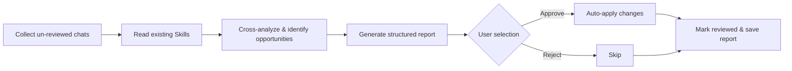

<div align="center">

[中文](README.md) · English

# 🔄 Copilot Self-Improving

#### Make Copilot Chat better over time — periodically reviews conversation history to optimize Skills, distill knowledge, and discover new automation opportunities


[Why This Exists](#-why-this-exists) · [What It Does](#-what-it-does) · [Quick Start](#-quick-start) · [Workflow](#-workflow-overview)

</div>

---

## 🤔 Why This Exists

Every conversation hides improvement opportunities — agent output below expectations, missing triggers, workflow gaps, domain knowledge scattered across sessions. But nobody manually reviews chat history to find them.

This Skill automates the feedback loop:

- **Scans all un-reviewed conversations** — collects chat history across all VS Code workspaces
- **Cross-references existing Skills** — finds missing triggers, workflow gaps, and redundant patterns
- **Extracts knowledge** — structures scattered technical insights, troubleshooting steps, and domain rules into `~/.copilot/knowledge/`
- **Audit trail** — every modification is logged to a change log for traceability and rollback

## 📋 What It Does

| Feature | Trigger | Description |
|---------|---------|-------------|
| Full Review | `daily review` / `每日回顾` | Collect → Analyze → Suggest → Apply (end-to-end) |
| Skill Optimization | `skill review` / `技能优化` | Focus on improving existing Skills |
| Knowledge Extraction | `knowledge extraction` / `知识提取` | Focus on knowledge distillation |
| Token Usage Stats | Runs automatically with full review | Estimates token consumption and cost per session |
| General Review | `self-improving` / `复盘` | Same as full review |

### What It Detects

- **Missing triggers** — you used a phrase that a Skill should handle but doesn't
- **Workflow gaps** — manual steps that could be automated
- **New Skill opportunities** — repeated multi-step patterns across sessions
- **Knowledge fragments** — technical troubleshooting, domain rules, best practices
- **Token cost trends** — estimates cost from transcript char counts + models.json pricing, highlights high-consumption sessions

## 🚀 Quick Start

**1. Clone**

```bash
# Windows
git clone https://github.com/JackySummerfield/copilot-self-improving.git "%USERPROFILE%\.copilot\skills\copilot-self-improving"

# macOS / Linux
git clone https://github.com/JackySummerfield/copilot-self-improving.git ~/.copilot/skills/copilot-self-improving
```

**2. First Run**

In Copilot Chat, type `daily review`. The Skill will auto-initialize all state files (review_state.json, change log, reviews directory, knowledge directory).

**3. Verify**

If it returns "No New Chat History" or a structured review report, you're all set.

## ⚙️ Workflow Overview



## 📄 Output Examples

<details>
<summary><b>Review Report</b></summary>

```markdown
## 📋 Review Summary

- Sessions reviewed: 12
- Workspaces covered: 4
- Time period: 2026-06-18 to 2026-06-24

## 💰 Token Usage & Cost (Estimated)
- Estimated input tokens: ~85k | output tokens: ~120k
- Estimated cost: ~$3.50 (based on models.json pricing)
- Primary model: Claude Opus 4.6 × 9 sessions

## 🔧 Existing Skill Optimizations

### 1. plantsim-copilot - Add missing triggers
- **Category**: Missing trigger
- **Evidence**: User said "help me write a SimTalk method" but Skill didn't activate
- **Suggested Change**: Add "写SimTalk", "SimTalk方法" to triggers
- **Impact**: Medium

## 🆕 New Skill Opportunities

### 1. git-workflow-helper
- **Purpose**: Standardize git operations (branch naming, commit messages, PR descriptions)
- **Evidence**: Same git workflow repeated across 3 sessions
- **Complexity**: Simple

## 📝 Knowledge Nuggets

### 1. OneDrive vs .git conflict
- **Target**: ~/.copilot/knowledge/pg-it-environment.md (append)
- **Content**: OneDrive sync locks .git/index, causing git operations to fail. Fix: exclude .git from OneDrive sync
```

</details>

<details>
<summary><b>Change Log</b></summary>

```markdown
## 2026-06-24 - plantsim-copilot - Missing Trigger
- **Reason**: User phrase "写SimTalk方法" not matched
- **Evidence**: session abc123, turn 5
- **Changes Made**:
  - SKILL.md triggers added: 写SimTalk, SimTalk方法

## 2026-06-24 - Knowledge Base - pg-it-environment
- **File**: ~/.copilot/knowledge/pg-it-environment.md
- **Action**: Appended
- **Entry**: OneDrive .git conflict resolution
```

</details>

## 🌟 References & Credits

- Workflow design inspired by [Claude Code](https://docs.anthropic.com/en/docs/claude-code)'s automatic memory management
- Knowledge base structure influenced by [Karpathy LLM wiki](https://github.com/karpathy/LLM101n)

## License

MIT — see [LICENSE](LICENSE).
