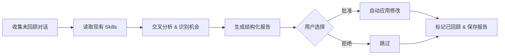

<div align="center">

中文 · [English](README.en.md)

# 🔄 Copilot Self-Improving

#### 让 Copilot Chat 越用越顺手——定期回顾对话历史，优化现有 Skill、提炼知识、发现新 Skill 机会


[为什么做这个](#-为什么做这个) · [它能做什么](#-它能做什么) · [快速开始](#-快速开始) · [Workflow](#-workflow-overview)

</div>

---

## 🤔 为什么做这个

每一条对话历史都藏着改进机会——agent 输出不达预期、触发词覆盖不全、工作流有缺口、领域知识散落各处。但没人会主动翻聊天记录去复盘。

本 Skill 将这个反馈闭环自动化：

- **扫描全部未回顾的对话** — 跨所有 VS Code 工作区收集聊天历史
- **交叉比对现有 Skill** — 找出遗漏触发词、工作流缺口、可合并的重复操作
- **提炼知识沉淀** — 将散落在对话中的技术经验、排错方法、领域知识结构化存入 `~/.copilot/knowledge/`
- **审计追踪** — 每次修改都记录到 change log，可追溯、可回滚

## 📋 它能做什么

| 功能 | 触发语 | 说明 |
|------|--------|------|
| 完整回顾 | `每日回顾` / `daily review` | 收集 → 分析 → 建议 → 应用全流程 |
| Skill 优化 | `技能优化` / `skill review` | 聚焦现有 Skill 改进 |
| 知识提取 | `知识提取` / `knowledge extraction` | 聚焦知识沉淀 |
| Token 用量统计 | 随完整回顾自动执行 | 估算各 session 的 token 消耗和成本 |
| 通用复盘 | `复盘` / `self-improving` | 同完整回顾 |

### 它能检测到什么

- **遗漏触发词** — 你用了某个说法但 Skill 没有响应
- **工作流缺口** — 需要手动补充的步骤，可以自动化
- **新 Skill 机会** — 跨 session 反复出现的多步模式
- **知识碎片** — 技术排错、领域规则、最佳实践
- **Token 消耗趋势** — 基于 transcript 字符数 + models.json 单价估算成本，识别高消耗 session

## 🚀 快速开始

**1. Clone**

```bash
# Windows
git clone https://github.com/JackySummerfield/copilot-self-improving.git "%USERPROFILE%\.copilot\skills\copilot-self-improving"

# macOS / Linux
git clone https://github.com/JackySummerfield/copilot-self-improving.git ~/.copilot/skills/copilot-self-improving
```

**2. 首次运行**

在 Copilot Chat 中输入 `每日回顾`，Skill 会自动初始化所有状态文件（review_state.json、change log、reviews 目录、knowledge 目录）。

**3. 验证**

如果返回 "No New Chat History" 或一份结构化回顾报告，说明已正常工作。

## ⚙️ Workflow Overview



## 📄 输出示例

<details>
<summary><b>回顾报告</b></summary>

```markdown
## 📋 Review Summary

- Sessions reviewed: 12
- Workspaces covered: 4
- Time period: 2026-06-18 to 2026-06-24

## 💰 Token Usage & Cost (估算)
- 估算 input tokens: ~85k | output tokens: ~120k
- 估算 cost: ~$3.50 (基于 models.json 单价)
- 主力模型: Claude Opus 4.6 × 9 sessions

## 🔧 Existing Skill Optimizations

### 1. plantsim-copilot - 补充触发词
- **Category**: Missing trigger
- **Evidence**: 用户说"帮我写个SimTalk方法"但 Skill 未命中
- **Suggested Change**: triggers 增加 "写SimTalk", "SimTalk方法"
- **Impact**: Medium

## 🆕 New Skill Opportunities

### 1. git-workflow-helper
- **Purpose**: 标准化 git 操作流程（branch命名、commit message、PR描述）
- **Evidence**: 3个 session 中重复执行相同 git 流程
- **Complexity**: Simple

## 📝 Knowledge Nuggets

### 1. OneDrive 与 .git 冲突
- **Target**: ~/.copilot/knowledge/pg-it-environment.md (append)
- **Content**: OneDrive 同步会锁定 .git/index，导致 git 操作失败。解决：将 .git 目录排除出 OneDrive 同步
```

</details>

<details>
<summary><b>变更日志</b></summary>

```markdown
## 2026-06-24 - plantsim-copilot - Missing Trigger
- **Reason**: 用户使用"写SimTalk方法"触发未命中
- **Evidence**: session abc123, turn 5
- **Changes Made**:
  - SKILL.md triggers 增加: 写SimTalk, SimTalk方法

## 2026-06-24 - Knowledge Base - pg-it-environment
- **File**: ~/.copilot/knowledge/pg-it-environment.md
- **Action**: Appended
- **Entry**: OneDrive .git 冲突解决方法
```

</details>

## 🌟 References & Credits

- Workflow 设计参考了 [Claude Code](https://docs.anthropic.com/en/docs/claude-code) 的 memory 自动管理机制
- 知识库结构受 [Karpathy LLM wiki](https://github.com/karpathy/LLM101n) 启发

## License

MIT — see [LICENSE](LICENSE).
